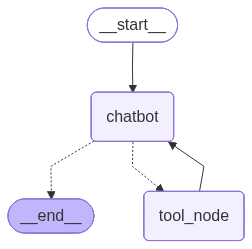

# SE-Engineer-Agent


SE-Engineer-Agent is an intelligent, adaptive Software Engineering assistant built entirely in Python. Powered by **Google's Gemini** advanced language models and **LangGraph**, it acts as both a dedicated mentor for students and a highly efficient co-pilot for professional software engineers.

## ✨ Core Capabilities

The agent operates dynamically based on the context of the user, offering distinct workflows:

* **Adaptive Persona Engine:** Automatically identifies if the user is a Student or an Employee. 
  * *For Students:* Acts as a patient teacher, exploring concepts deeply from multiple angles.
  * *For Professionals:* Delivers precise, production-ready solutions with zero fluff.
* **UML & System Design:** Architect systems on the fly. The agent generates highly accurate **Mermaid.js** code for UML diagrams and provides direct links to [Mermaid Live](https://mermaid.live) for instant visualization and testing.
* **Deep Knowledge Retrieval:** Leverages an internal `software_knowledge_base` tool to accurately answer complex theoretical engineering questions without relying on external book references.
* **Academic Assistance:** Capable of solving software engineering exam and paper questions. It provides accurate answers or routes users to specific external resources (like YouTube tutorials) when appropriate.

## 🏗 Architecture & LangGraph Workflow

The agent's reasoning and tool-use capabilities are orchestrated using a LangGraph workflow. This allows for stateful, multi-step execution where the agent can plan, retrieve knowledge, generate code, and review its own output before responding.



## 🚀 Getting Started

### Prerequisites

* Python 3.9+
* A Google Gemini API Key

### Installation

1. Clone the repository:
   ```bash
   git clone https://github.com/SL-MGx03/SE-Engineer-Agent.git
   cd SE-Engineer-Agent
   ```

2. Create and activate a virtual environment:
   ```bash
   # On macOS/Linux
   python -m venv venv
   source venv/bin/activate
   
   # On Windows
   venv\Scripts\activate
   ```

3. Install the required dependencies:
   ```bash
   pip install -r requirements.txt
   ```

### Usage

Set up your Gemini API key in your environment or a `.env` file:

```bash
export GEMINI_API_KEY="your_api_key_here"
```

Then, run the agent:

```bash
python app.py
```

## 🤝 Contributing

Contributions, issues, and feature requests are welcome! Feel free to check the issues page if you want to contribute.

## 📝 License

This project is licensed under the MIT License.
